# Assignment 5 — Bash Script Automation Drill (OPS Checklist)

Part of the DevOps Micro Internship (DMI) Cohort 3 with Agentic AI

---

## Purpose

In this assignment, you will practice Bash scripting by building a series of small automation scripts covering environment setup, variables, arrays, loops, file conditionals, if-else logic, and functions. These scripts form the foundation of real-world Linux automation used in DevOps, cloud, and production support environments.

---

# Task 1 — Bash Environment & Workspace Setup

## Goal

Verify that Bash is available on your system and create a clean workspace for this assignment.

### Evidence

#### Screenshot 1 — Output of `echo $SHELL` and `bash --version`

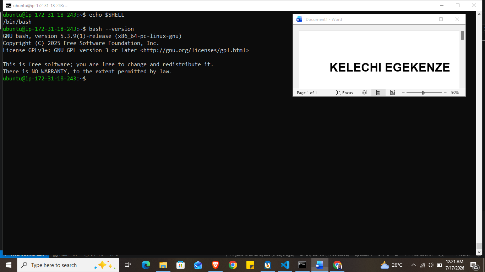

---

#### Screenshot 2 — Output of `pwd` and `ls -lah` showing the scripts directory

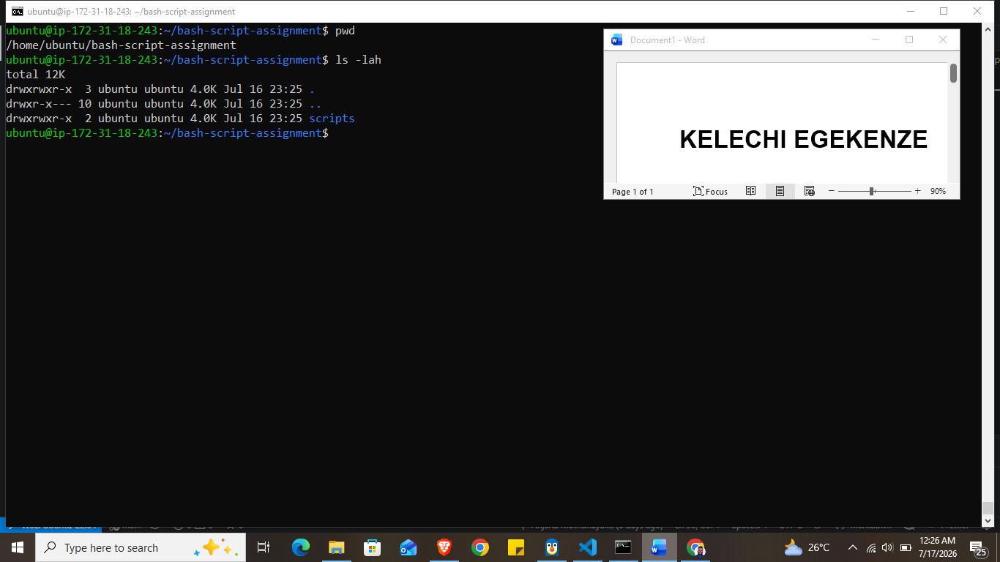

---

### Notes

Answer the following in your own words:

**1. What is Bash?**

- Bash (short for "Bourne-Again SHell") is a command-line interpreter and scripting language. It allows you to interact directly with your computer's operating system by typing text commands. It serves as the default shell on most Linux distributions and macOS.

---

**2. What is the difference between shell and Bash?**

Add your answer here.

---

**3. Why is it important to confirm the Bash version before writing scripts?**

- This is because different versions allow specific features than others.

---

# Task 2 — Your First Bash Script

## Goal

Create your first Bash script, make it executable, and run it from the terminal.

### Evidence

#### Screenshot 1 — Content of `first-script.sh`

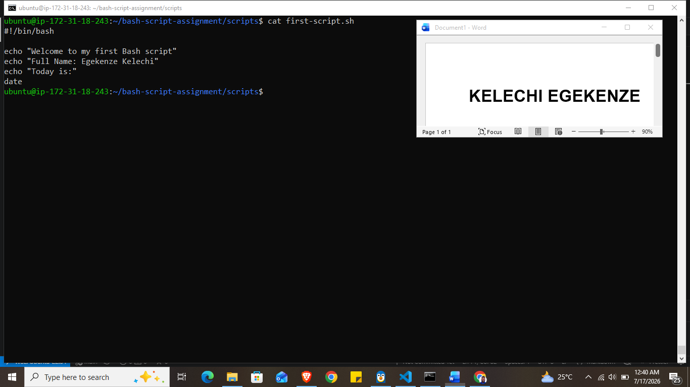

---

#### Screenshot 2 — Output of `./first-script.sh`

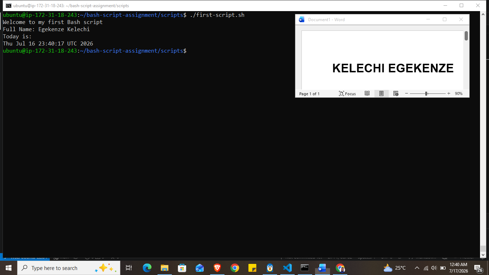

---

#### Screenshot 3 — Output of `ls -l first-script.sh` showing executable permission

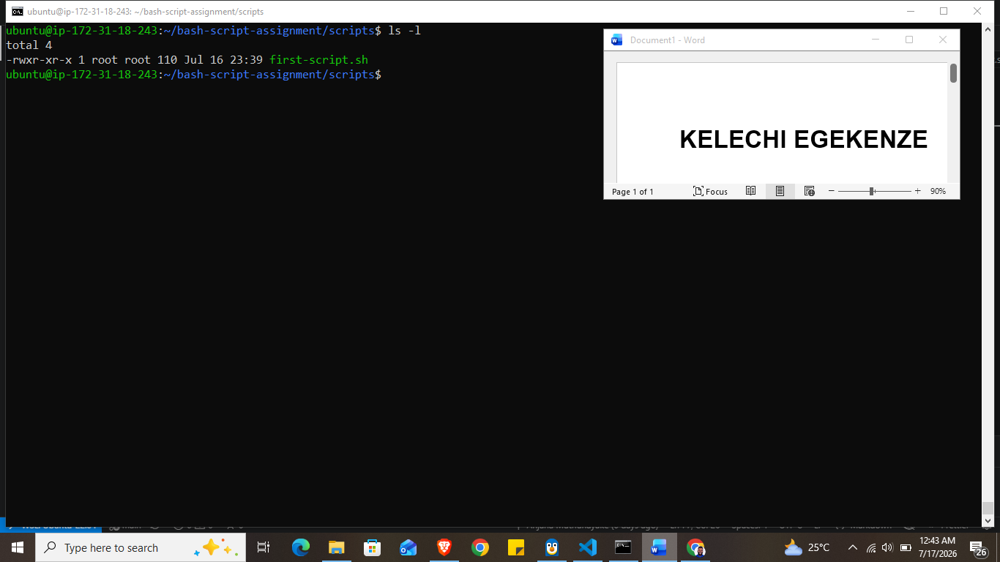

---

### Notes

Answer the following in your own words:

**1. What is the purpose of `#!/bin/bash`?**

- To tell the system to run the script using the bash shell.

---

**2. Why do we use `chmod +x` before running a script?**

- So we can execute the script. It makes the script executable.

---

**3. What is the difference between running a script using `./script.sh` and `bash script.sh`?**

- The primary difference is that ./script.sh executes the script as a standalone program using the interpreter defined in its shebang line, whereas bash script.sh explicitly forces the script to run inside the Bash shell interpreter, completely ignoring any shebang.

---

# Task 3 — Variables: User Information Script

## Goal

Use variables to store and display user-related information.

### Evidence

#### Screenshot 1 — Content of `user-info.sh`

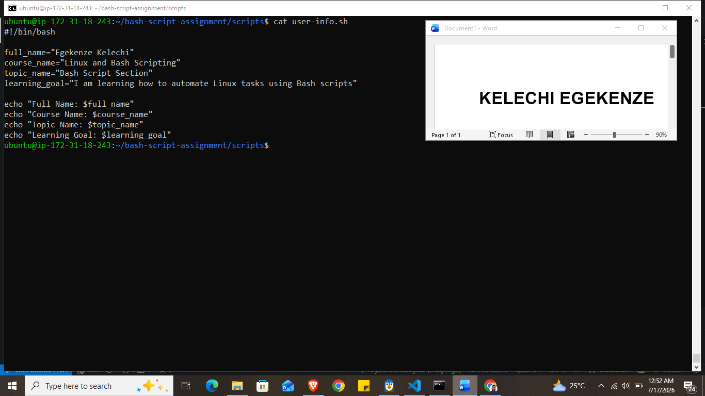

---

#### Screenshot 2 — Output of `./user-info.sh`

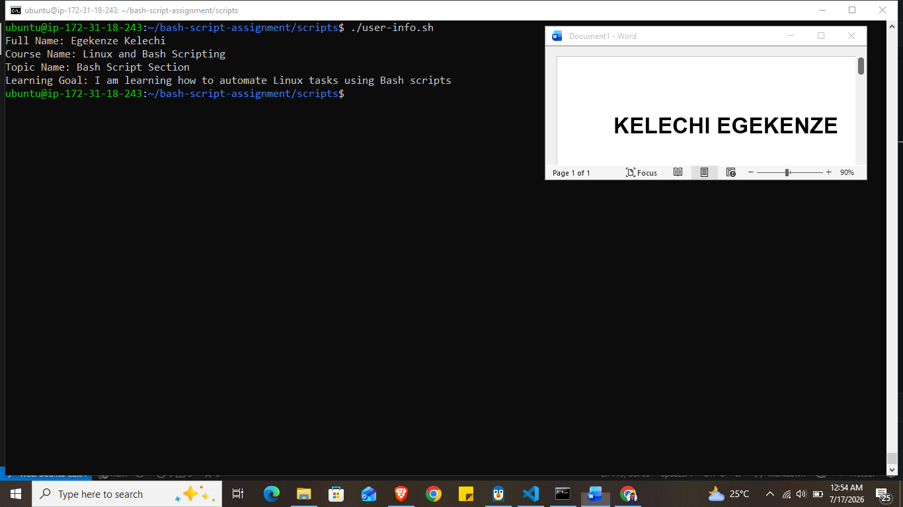

---

### Notes

Answer the following in your own words:

**1. What is a variable in Bash?**

- A variable in Bash is a temporary storage location identified by a name that holds a text string or a numeric value.

---

**2. Why should we avoid spaces around the `=` sign when creating variables?**

- Prevents syntax errors and misinterpretation by the interpreter or compiler. 

---

**3. How do you access the value stored inside a Bash variable?**

- You access the value of a Bash variable by prefixing its name with a dollar sign ($).

---

# Task 4 — Arrays & Loops: Tools Checklist Script

## Goal

Use arrays and loops to print a checklist of tools used in Bash scripting.

### Evidence

#### Screenshot 1 — Content of `tools-checklist.sh`

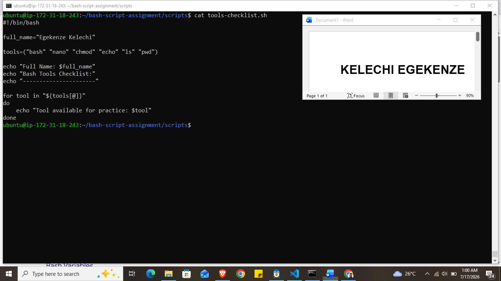

---

#### Screenshot 2 — Output of `./tools-checklist.sh`

---

### Notes

Answer the following in your own words:

**1. What is an array in Bash?**

- An array in Bash is a variable that holds multiple values under a single name.
---

**2. Why are arrays useful in scripts?**

- Arrays allow you to store and manipulate multiple related values under a single variable name. 

---

**3. What does `"${tools[@]}"` mean?**

- It expands a stored array into separate, individually quoted arguments.

---

**4. What is the purpose of the `for` loop in this script?**

- for loop in a script is to execute a specific block of code repeatedly. It automates repetitive tasks and is primarily used to either iterate through a collection of items (such as a list, array, or string) or run a command a precise, known number of times.

---

# Task 5 — Loops: Number Counter Script

## Goal

Use loops to repeat a task multiple times.

### Evidence

#### Screenshot 1 — Content of `counter.sh`

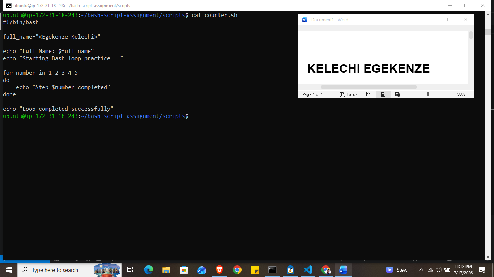

---

#### Screenshot 2 — Output of `./counter.sh`

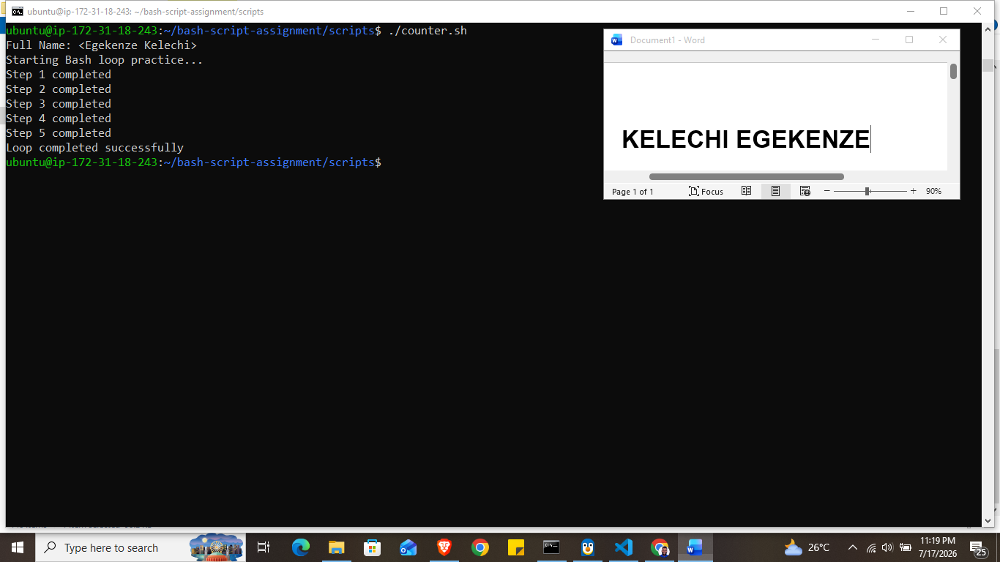

---

### Notes

Answer the following in your own words:

**1. What is a loop?**

- A loop is an iteration 

---

**2. Why do we use loops in Bash scripting?**

- To automate repetitive task and eliminate manual typing.

---

**3. How many times did the loop run in your script?**

- The loop ran 5 times.

---

**4. What would you change if you wanted the loop to run 10 times?**

- I'd add more numbers to the for loop. 5 more numbers precisely.

---

# Task 6 — Files & Conditionals: File Validation Script

## Goal

Use file checks and conditionals to verify whether files and directories exist.

### Evidence

#### Screenshot 1 — Output of `ls -lah ../test-folder`

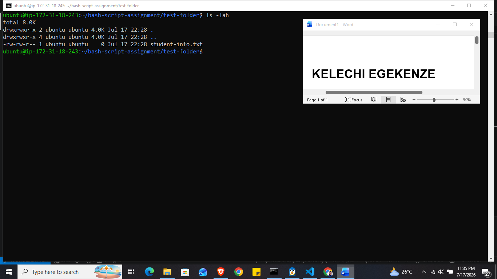

---

#### Screenshot 2 — Content of `file-check.sh`

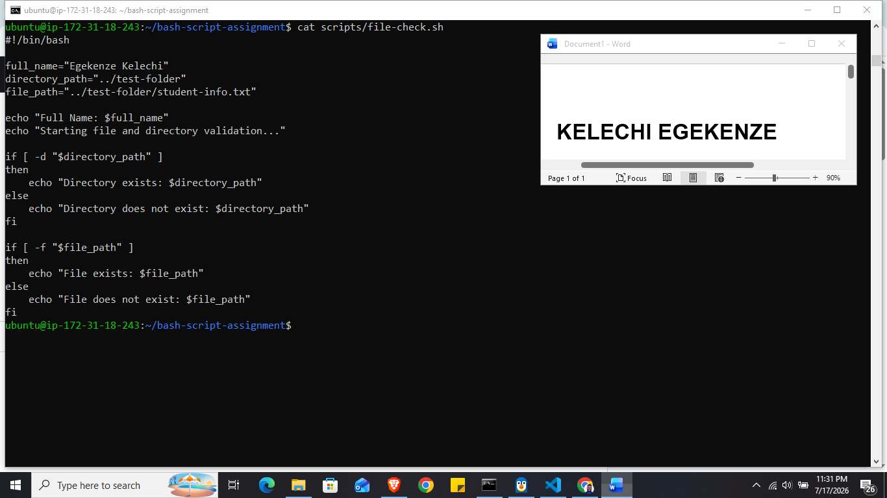

---

#### Screenshot 3 — Output of `./file-check.sh`

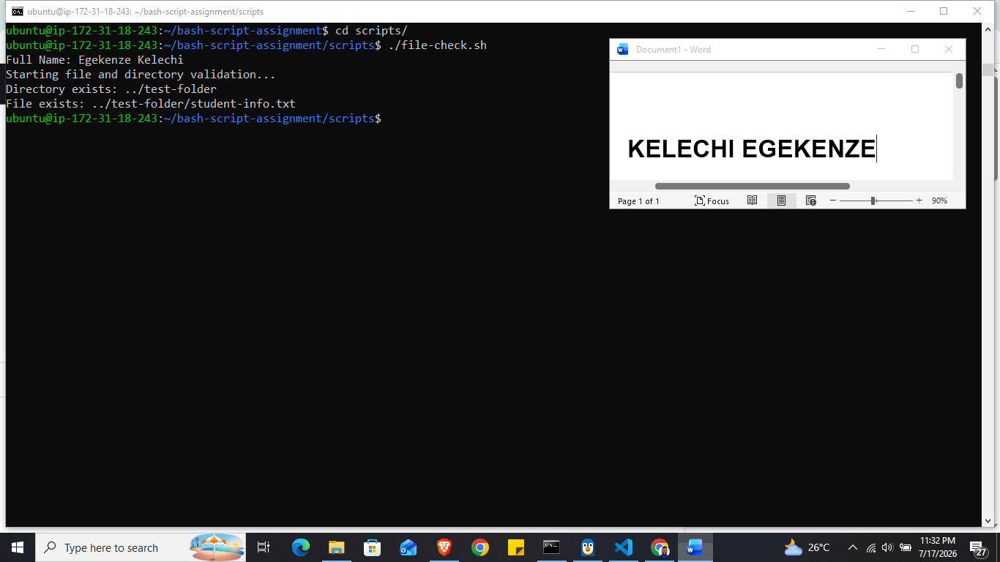

---

### Notes

Answer the following in your own words:

**1. What does `-d` check in Bash?**

- It checks if a directory exists

---

**2. What does `-f` check in Bash?**

- It checks if a file exists

---

**3. Why should file and directory paths be stored in variables?**

- To maintain code quality. Having them stored as variables means, you only change them once and it takes effect everywhere the variable is called.

---

**4. What happens if the file does not exist?**

- It prints the following below:
* Directory does not exist: ../test-folder
* File does not exist: ../test-folder/student-info.txt

---

# Task 7 — Conditionals: Pass or Retry Script

## Goal

Use if-else conditionals to make decisions based on a variable value.

### Evidence

#### Screenshot 1 — Content of `score-check.sh` with `score=85`

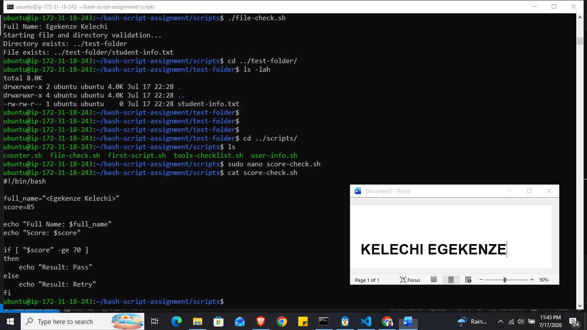

---

#### Screenshot 2 — Output showing `Result: Pass`

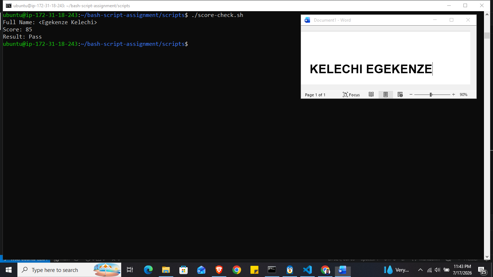

---

#### Screenshot 3 — Content of `score-check.sh` with `score=55`

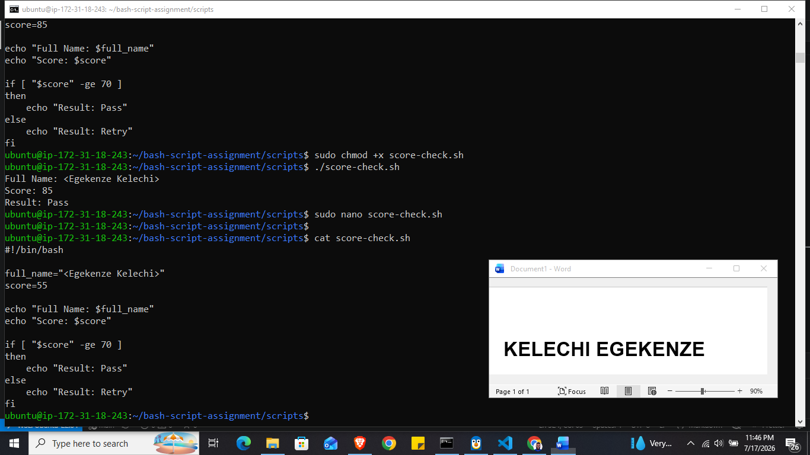

---

#### Screenshot 4 — Output showing `Result: Retry`

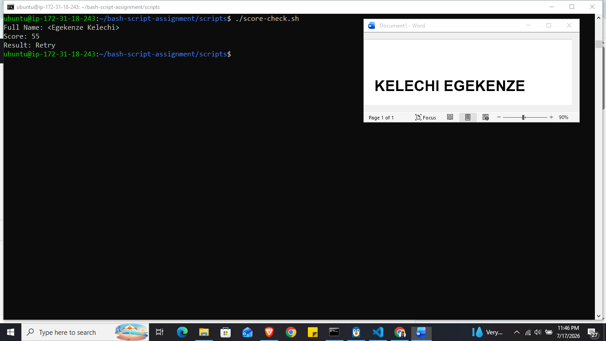

---

### Notes

Answer the following in your own words:

**1. What is the purpose of if-else in Bash?**

- The purpose of an if-else statement in Bash is to make decisions in a script by executing different blocks of code based on whether a condition is true or false.

---

**2. What does `-ge` mean?**

- Greater than or equal to

---

**3. Why should conditions be tested with different values?**

- To see the outcome of each test case in the if-else statement.

---

**4. How can conditionals help in automation scripts?**

- Conditionals help in automation scripts by allowing the script to make decisions based on the current state of the system or the result of a command.
---

# Task 8 — Functions: Final Bash Automation Script

## Goal

Create a final Bash script using functions to organize reusable code.

### Evidence

#### Screenshot 1 — Content of `final-automation.sh`

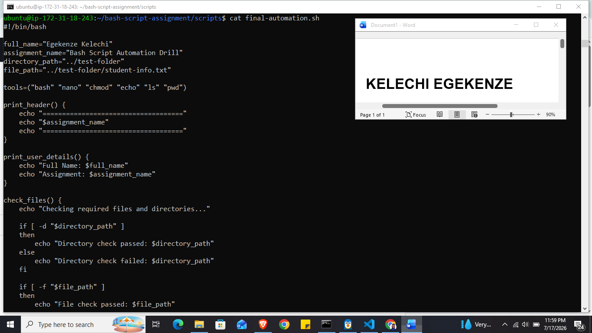

---

#### Screenshot 2 — Output of `./final-automation.sh`

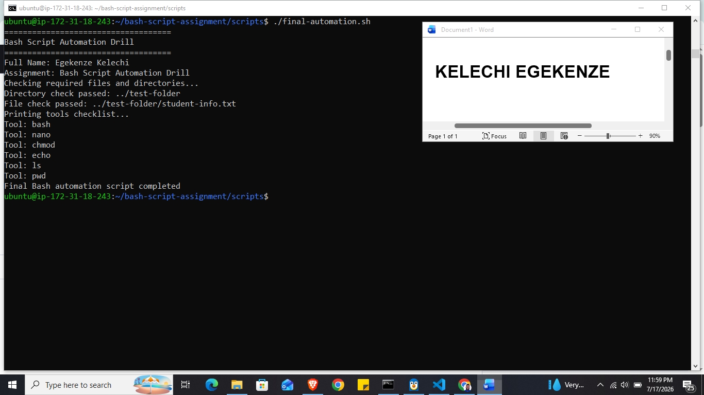

---

#### Screenshot 3 — Output of `ls -lah` showing all created scripts

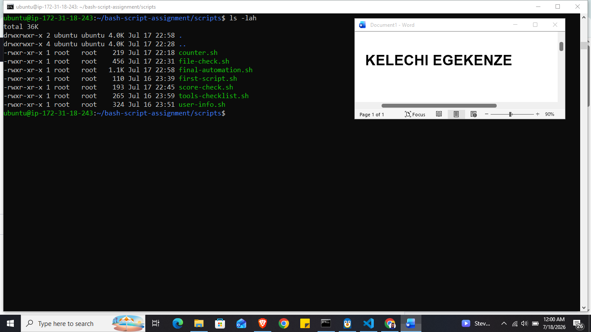
---

### Notes

Answer the following in your own words:

**1. What is a function in Bash?**

- A function is a reusable piece of code.

---

**2. Why are functions useful in scripts?**

- Functions are essential in scripts because they enable code reusability and modularity

---

**3. Which functions did you create in this script?**

- Four functions were created, namely:
* print_header
* print_user_details
* check_files
* print_tools

---

**4. How does this final script combine variables, arrays, loops, conditionals, files, and functions?**

- It combines them perfectly. It uses variables to store reusable information such as my name, assignment name, directory path, and file path. It uses an array to store a list of Bash tools and a for loop to iterate through the array and print each tool. Conditionals (if-else) are used to check whether the required directory and file exist and display the appropriate success or failure message. The script also works with files by verifying the existence of a directory and a text file using the -d and -f test operators. Finally, functions organize the script into reusable sections (print_header, print_user_details, check_files, and print_tools), making the code cleaner, easier to read, and easier to maintain. Together, these features demonstrate how Bash can be used to automate repetitive tasks in a structured and efficient way.

---

# LinkedIn Post (Required)

## Evidence

#### LinkedIn Post URL

Paste your LinkedIn post URL here:

`https://www.linkedin.com/posts/kelechi-egekenze_devops-bash-linux-share-7484022210081361920-waYv/?utm_source=social_share_send&utm_medium=member_desktop_web&rcm=ACoAADT58zgB1d_Na5CgQd9L3ayPC9yKCe5WLA4`

---

#### Screenshot — Published LinkedIn post

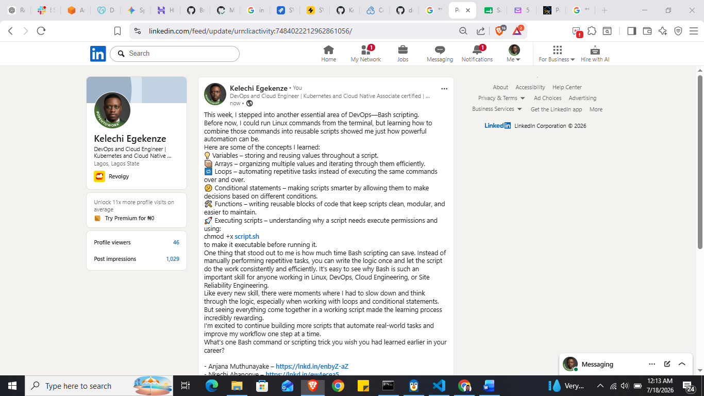

---

# Submission Instructions

- Add all required screenshots in your submission
- Full name must be visible in required screenshots
- All script files must be created and run successfully
- Required notes must be answered clearly for every task
- Do not expose sensitive information (keys, passwords, credentials)

---

# Completion Checklist

- [✅] Task 1: Environment setup verified, workspace created (Screenshots 1–2, Notes answered)
- [✅] Task 2: First script created, executed, permissions verified (Screenshots 1–3, Notes answered)
- [✅] Task 3: Variables script created and run (Screenshots 1–2, Notes answered)
- [✅] Task 4: Arrays and loops script created and run (Screenshots 1–2, Notes answered)
- [✅] Task 5: Counter loop script created and run (Screenshots 1–2, Notes answered)
- [✅] Task 6: File validation script created and run (Screenshots 1–3, Notes answered)
- [✅] Task 7: Pass/Retry conditional script tested with both values (Screenshots 1–4, Notes answered)
- [✅] Task 8: Final automation script created and run (Screenshots 1–3, Notes answered)
- [✅] All scripts run without errors
- [✅] Full Name visible in all required screenshots
- [✅] LinkedIn post published and URL submitted
- [✅] No sensitive data exposed

---

## 📌 About DMI & CloudAdvisory

DevOps Micro Internship (DMI) is a project-based DevOps program run by Pravin Mishra (The CloudAdvisory) focused on real-world execution, systems thinking, and career readiness.

It helps learners build strong DevOps foundations with hands-on experience.

---

## 📌 Resources

- 🌐 DMI Official Website: https://pravinmishra.com/dmi  
- 🎓 DevOps for Beginners (Udemy): https://www.udemy.com/course/devops-for-beginners-docker-k8s-cloud-cicd-4-projects/  
- 🎓 Agentic AI DevOps with Claude Code: https://www.udemy.com/course/ultimate-agentic-ai-devops-with-claude-code/  
- 🎓 DevOps with Claude Code: Terraform, EKS, ArgoCD & Helm: https://www.udemy.com/course/devops-with-claude-code-terraform-eks-argocd-helm/  
- ▶️ YouTube Playlist: https://www.youtube.com/playlist?list=PLFeSNDtI4Cho  
- 🔗 Pravin Mishra (LinkedIn): https://www.linkedin.com/in/pravin-mishra-aws-trainer/  
- 🏢 CloudAdvisory (LinkedIn): https://www.linkedin.com/company/thecloudadvisory/

---

*This submission is part of DevOps Micro Internship (DMI) Cohort 3 — Agentic AI Track.*