# Assignment 6 — Build an AI-Assisted Linux Health Check (AI-Assisted Linux Incident Triage)

Part of the DevOps Micro Internship (DMI) Cohort 3 with Agentic AI

---

## Purpose

In this assignment, you will build a read-only Bash triage script that checks the health of your Ubuntu server and Nginx application, connect it to Claude Code as a reusable `/linux-triage` skill, simulate a controlled Nginx incident, use the skill to gather and analyze evidence, recover the service manually, and verify recovery. The workflow follows the Agentic Loop: Gather → Analyze → Human Act → Verify.

---

# Task 1 — Confirm the Healthy Baseline and Create the Workspace

## Goal

Confirm that Nginx and the React application are healthy before building the automation.

### Evidence

#### Screenshot 1 — Output of `systemctl is-active nginx`, `ss -ltn | grep ':80'`, and `curl -I http://localhost`

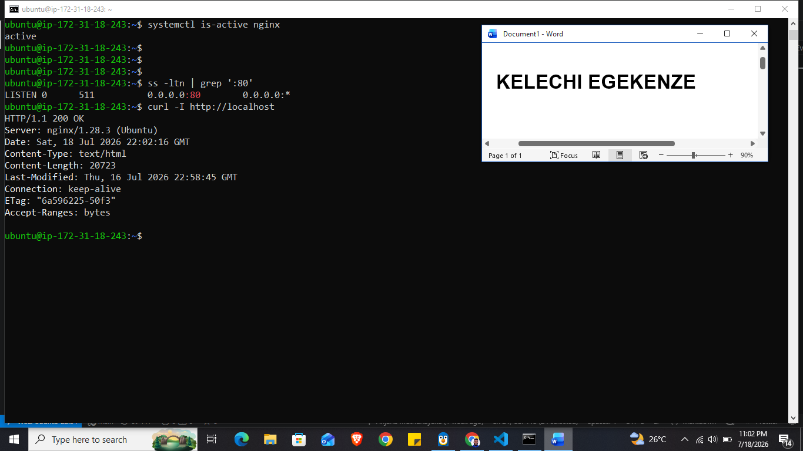

---

#### Screenshot 2 — Output of `pwd` and `find . -maxdepth 4 -type d | sort` showing the workspace folder structure

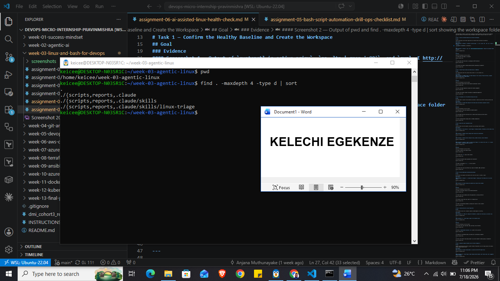

---

### Notes

Answer the following in your own words:

**1. What proves that Nginx is running?**

- The systemctl status nginx command shows that nginx is active and running. Also, the systemctl is-active nginx command shows nginx is active.

---

**2. What proves that the server is listening for HTTP traffic?**

- The ss -ltn | grep ':80' shows port 80 is listening and that's the default port for HTTP

---

**3. Why must you capture a healthy baseline before simulating an incident?**

- So you can tell the incident occurred given the baseline was once healthy.

---

# Task 2 — Create Project Context and Safety Rules in CLAUDE.md

## Goal

Tell Claude exactly what this project does and what it is not allowed to do.

### Evidence

#### Screenshot 3 — CLAUDE.md open in VS Code showing all four sections (Project Overview, Incident Workflow, Safety Rules, Output Rules)

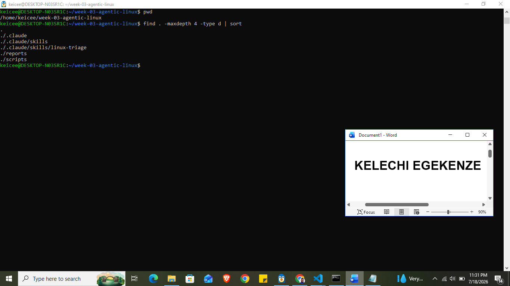

---

### Notes

Answer the following in your own words:

**1. Why should Claude receive project-specific operational rules?**

- So it doesn't work outside the scope of the project.

---

**2. Why is the human required to execute the recovery command?**

- So they accept or decline after making sure the changes align with the project scope.

---

**3. Which rule prevents Claude from making an unsupported diagnosis?**

- Safety Rules

---

# Task 3 — Use Agentic AI to Plan Before Writing the Script

## Goal

Use Claude Code to inspect the environment and produce a read-only plan before creating any Bash code.

### Evidence

#### Screenshot 4 — Claude Code showing the five-check plan and read-only inspection results

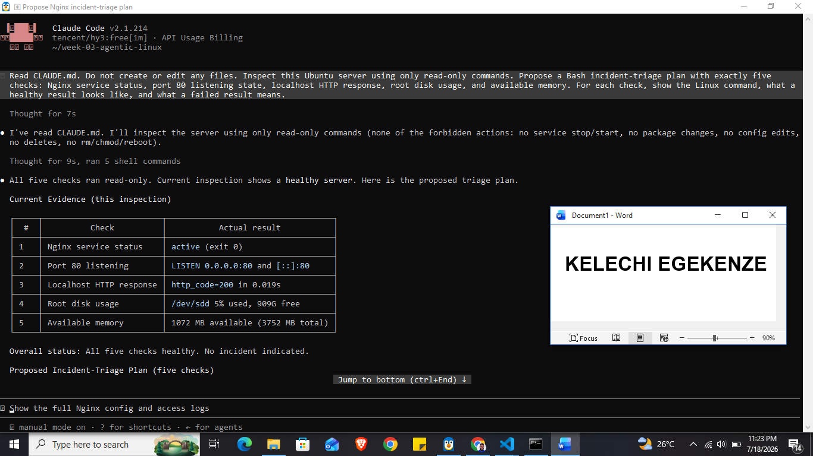

---

### Notes

Answer the following in your own words:

**1. Which part of this task represents the Gather phase?**

- The incident workflow task

---

**2. Did Claude follow the instruction not to create files? How did you verify this?**

- Yes it did. There were no new files created, it just gave descriptions of what it was asked to do.

---

**3. Why is planning before coding useful in DevOps automation?**

- So everything goes smoothly with little to no errors.

---

# Task 4 — Build the Linux Triage Bash Script

## Goal

Create one Bash script that gathers consistent Linux and Nginx health evidence.

### Evidence

#### Screenshot 5 — Top section of `linux-triage.sh` showing variables, thresholds, and the checks array

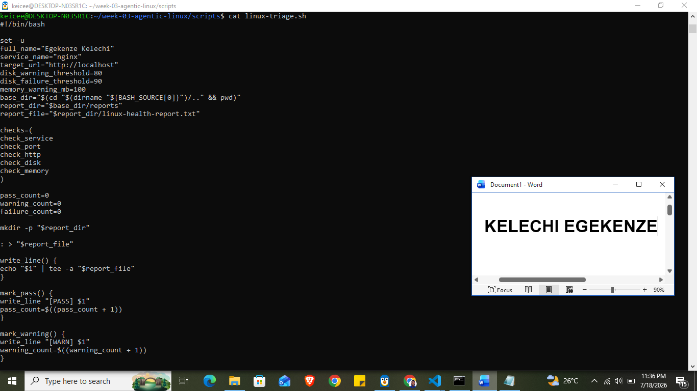

---

#### Screenshot 6 — Middle section showing check functions and conditionals

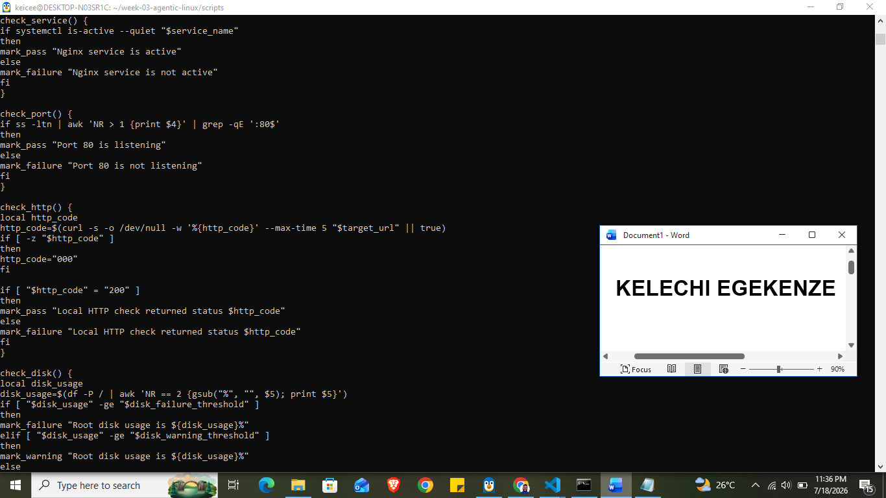

---

#### Screenshot 7 — Bottom section showing the loop, summary function, and exit behavior

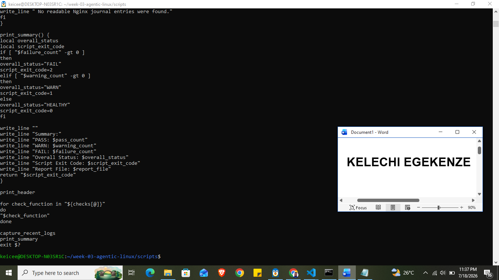

---

#### Screenshot 8 — Output of `bash -n scripts/linux-triage.sh` (no syntax errors) and `ls -l scripts/linux-triage.sh` showing executable permission

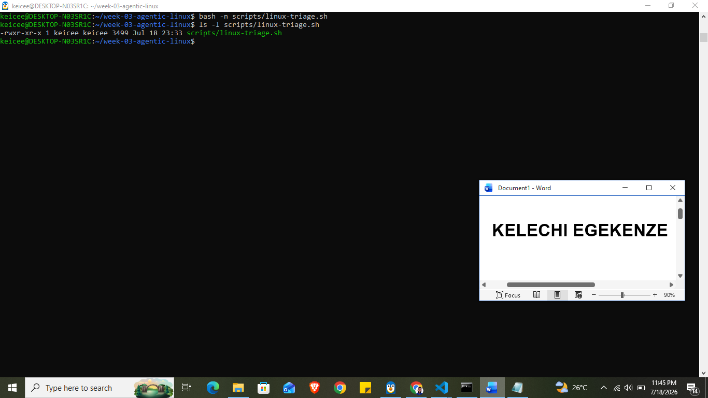

---

### Notes

Answer the following in your own words:

**1. What is stored in the checks array?**

- All check functions

---

**2. How does the `for` loop use that array?**

- It loops through each function in the array and runs each one individually.

---

**3. Why are the health checks separated into functions?**

- For ease of reusability.

---

**4. What is the purpose of `$(...)` in this script?**

- In this script, $(...) is used for command substitution.

It runs the command inside the parentheses and inserts its output into the surrounding shell expression. For example, in the script:

---

**5. Why does the script use different exit codes for HEALTHY, WARN, and FAIL?**

- The script uses different exit codes to communicate the severity of the incident state to other tools or automation.

---

# Task 5 — Run and Understand the Healthy-State Report

## Goal

Run the Bash script against the healthy server and verify that it creates a report.

### Evidence

#### Screenshot 9 — Output of `./scripts/linux-triage.sh` showing your Full Name and all five check results

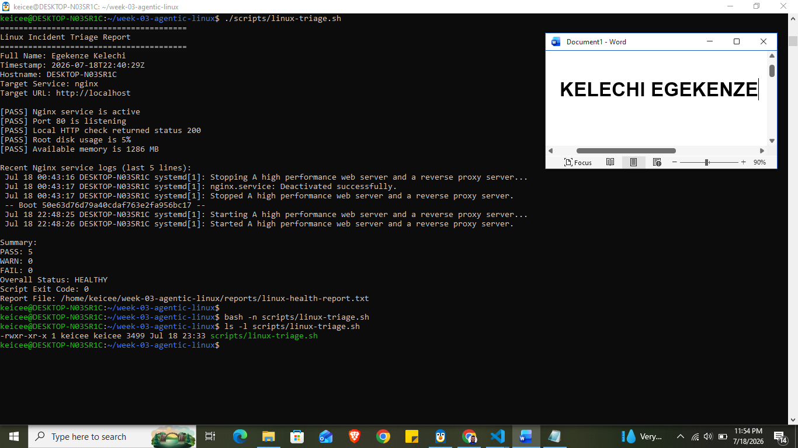

---

#### Screenshot 10 — Output showing the captured exit code and final summary

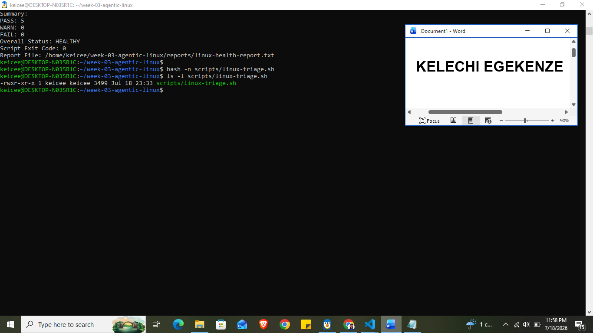

---

### Notes

Answer the following in your own words:

**1. What is the overall status of your healthy baseline?**

- The overall status of the healthy baseline is HEALTHY. 

---

**2. Which exact Linux evidence proves the application is serving traffic?**

- The strongest evidence is:

The service is active: systemctl reports nginx as active.
The port is listening on port 80: ss shows 0.0.0.0:80 and [::]:80.
The application responds over HTTP: curl returned status code 200 from http://localhost.
These checks together prove that the application is currently serving traffic.

---

**3. Did your script return exit code 0 or 1? Explain why.**

It returned exit code 0. Which means, everything worked as it should.

---

**4. What is the difference between a warning and a failure in this script?**

- In this script, a warning and a failure are different levels of severity:

Warning: the check detected a non-ideal condition, but it is not a complete outage. The script records it with [WARN] and increments the warning count.
Failure: the check detected a serious problem or a broken condition. The script records it with [FAIL] and increments the failure count.

---

# Task 6 — Create and Run the /linux-triage Skill

## Goal

Turn the Bash script into a reusable, manually invoked Agentic AI workflow.

### Evidence

#### Screenshot 11 — `SKILL.md` showing the frontmatter, allowed tool restrictions, and safety rules

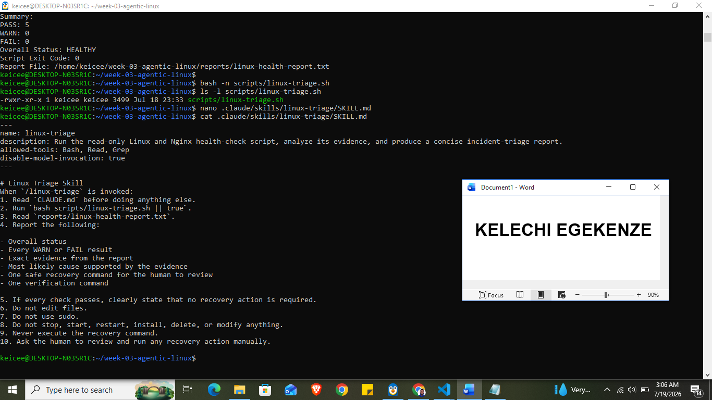

---

#### Screenshot 12 — `/linux-triage` output for the healthy server

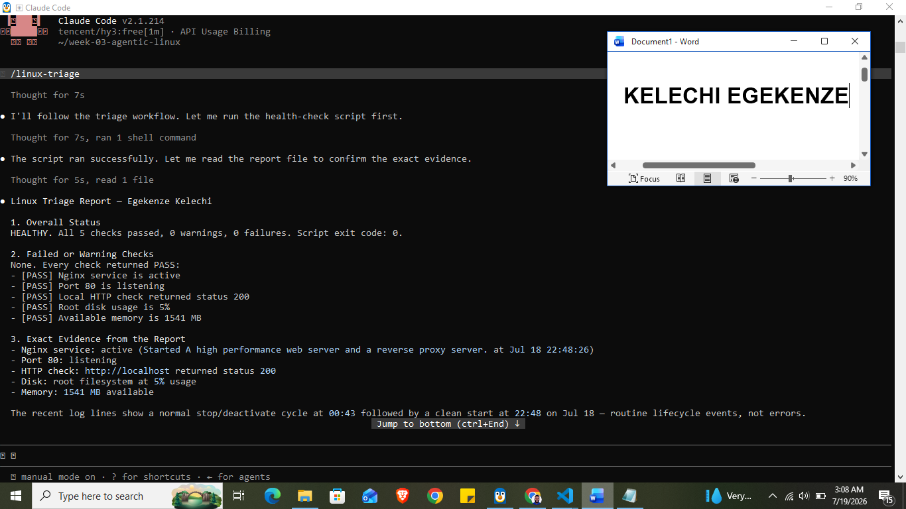

---

### Notes

Answer the following in your own words:

**1. Why does this skill have Bash, Read, and Grep, but not Write?**

- We don't want any changes made to the file.

---

**2. Why is `disable-model-invocation: true` useful for this skill?**

- So a human intervention is needed to trigger the command.

---

**3. What part is performed by Bash, and what part is performed by Claude?**

- In this workflow:

Bash performs the evidence gathering:

runs the triage script
collects system facts such as service status, port listening, HTTP response, disk usage, memory, and logs
writes the report to a file
Claude performs the analysis:

reads the report
interprets the findings
explains the likely cause and suggests a safe recovery step
does not make changes or execute recovery actions automatically
So Bash provides the evidence, and Claude analyzes it and recommends the next action.

---

**4. Why is this better than asking Claude "Is my server healthy?" without giving it evidence?**

- Asking “Is my server healthy?” without evidence makes Claude guess from general knowledge or assumptions. This approach is stronger because it:

uses fresh system data from the triage script,
ties conclusions to concrete checks such as service status, port listening, HTTP response, disk, memory, and logs,
reduces hallucinations and unsupported claims,
and gives a safe, reviewable next step instead of a vague opinion.

---

# Task 7 — Simulate an Nginx Incident and Let the Skill Diagnose It

## Goal

Create a controlled service failure, gather evidence through Bash, and let Claude analyze the evidence without taking recovery action.

### Evidence

#### Screenshot 13 — Output showing Nginx is inactive and the HTTP request fails

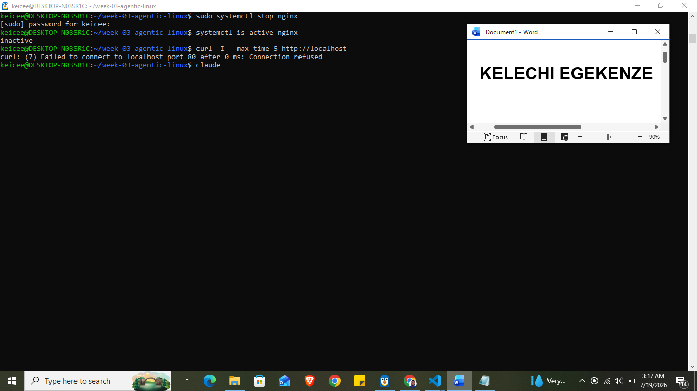

---

#### Screenshot 14 — `/linux-triage` output showing failed evidence, most likely cause, and a suggested recovery command

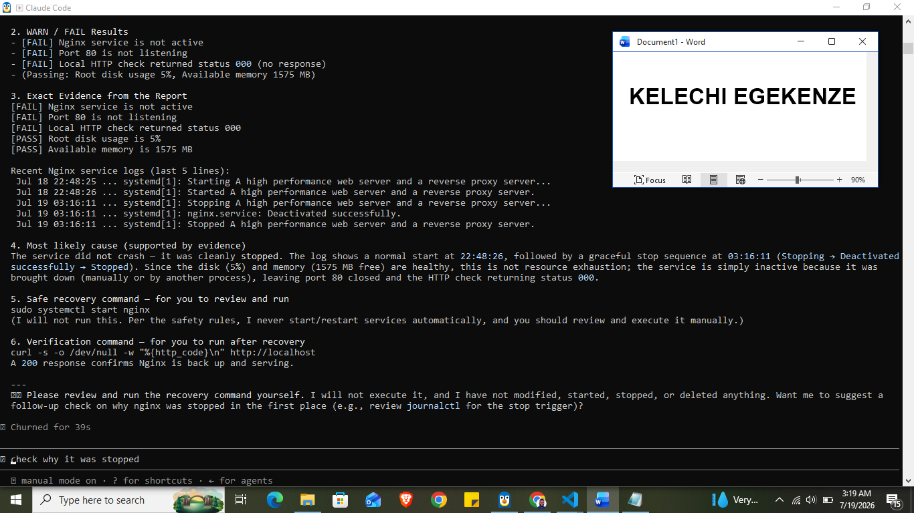

---

#### Screenshot 15 — `incident-failure-report.txt` showing the failed checks and your Full Name

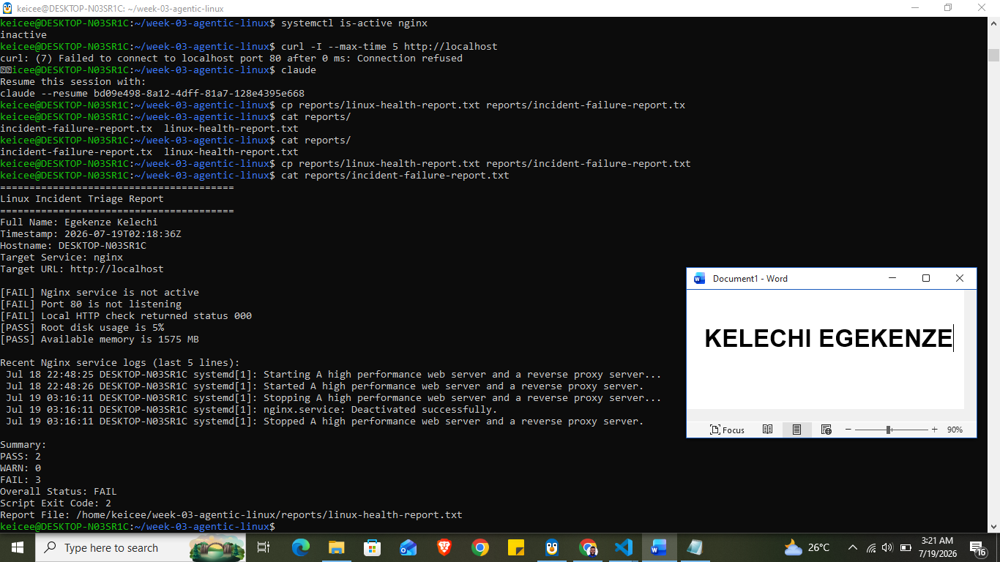

---

### Notes

Answer the following in your own words:

**1. Which three checks failed?**

- [FAIL] Nginx service is not active
[FAIL] Port 80 is not listening
[FAIL] Local HTTP check returned status 000

---

**2. What evidence supports the conclusion that Nginx is unavailable?**

- [FAIL] Nginx service is not active

---

**3. Did Claude execute the recovery command? Why is that important?**

- No it didn't. Because we told it not to.

---

**4. Which phase of the Agentic Loop is represented by the Bash report?**

- The Bash report represents the “observe” phase of the Agentic Loop.

It gathers evidence from the system so the agent can analyze the current state before deciding on any action.

---

**5. Which phase is represented by Claude's explanation?**

- Claude’s explanation represents the “analyze” phase of the Agentic Loop.

It takes the observed evidence from the Bash report, interprets it, and explains what it means.

---

# Task 8 — Recover Manually, Verify Again, and Write the Incident Summary

## Goal

Recover the service as the human operator and prove that the system is healthy again.

### Evidence

#### Screenshot 16 — Output showing Nginx is active and `curl -I http://localhost` returns 200 OK

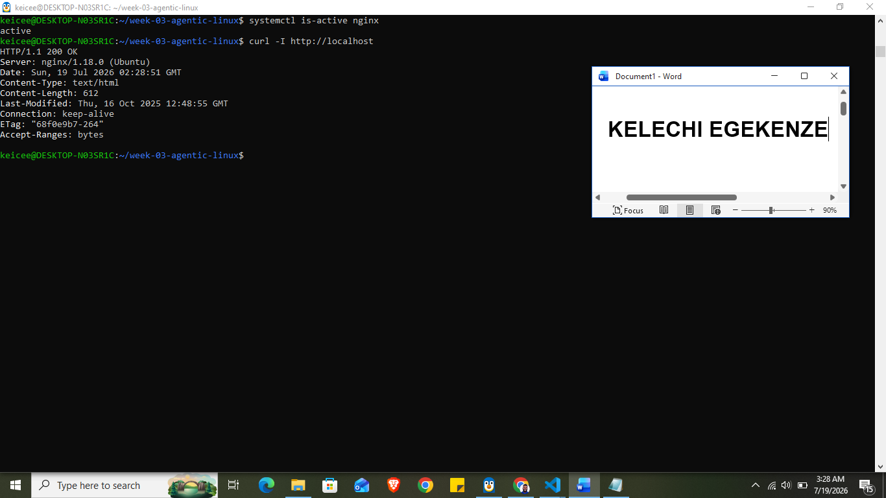

---

#### Screenshot 17 — Second `/linux-triage` output showing successful recovery with no FAIL results

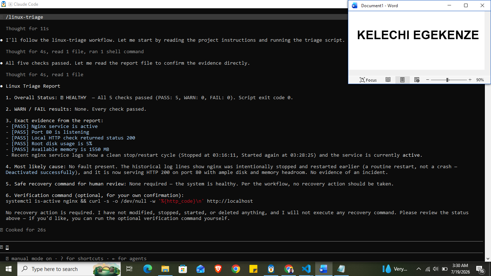

---

#### Screenshot 18 — Output of `ls -lah reports` showing both `incident-failure-report.txt` and `recovery-report.txt`

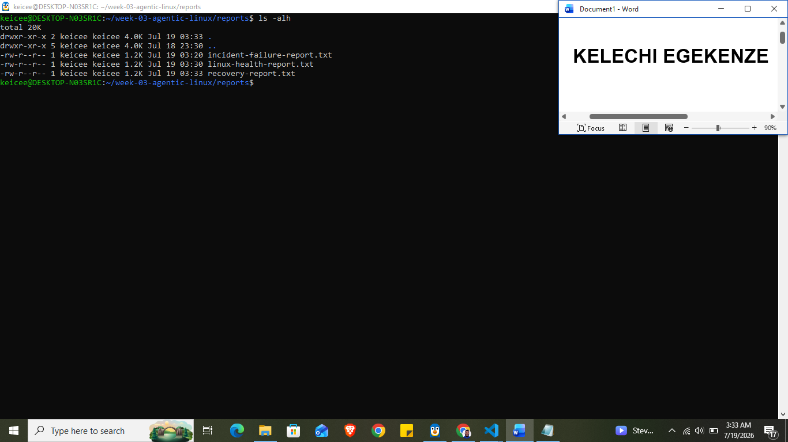

---

#### Screenshot 19 — `incident-summary.md` showing all required sections and your Full Name

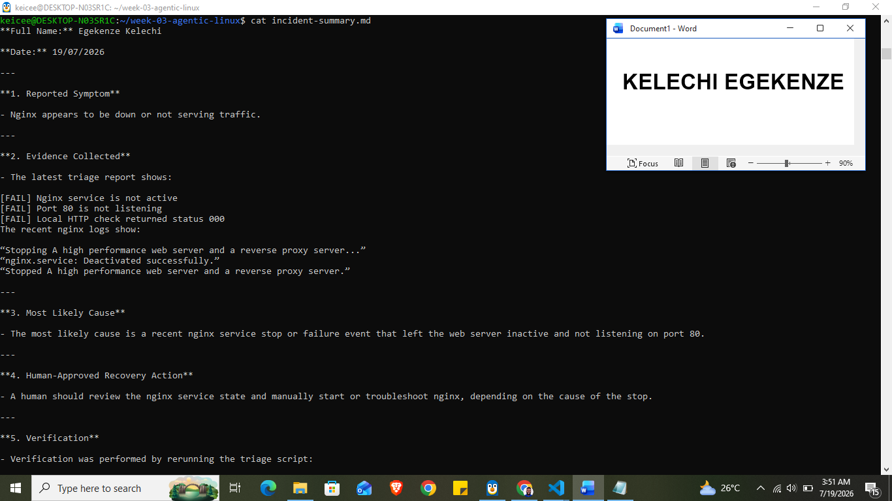

---

### Notes

Answer the following in your own words:

**1. What action did you execute manually?**

- `sudo systemctl start nginx` command was ran

---

**2. What evidence proves that the service recovered?**

- All health checks passed.

---

**3. Why is the second triage run necessary?**

- To make sure nginx started successfully so we can generate a new report.

---

**4. What could go wrong if an AI agent automatically restarted every failed service?**

- It could make the situation worse or hide the real cause.

Potential problems:

A service might fail again immediately, causing repeated restarts and more noise.
The agent might restart the wrong service and disrupt unrelated workloads.
It could mask a deeper issue such as bad configuration, dependency failures, or resource exhaustion.
It could create unsafe side effects on a live system without human review.
That is why the workflow is designed to recommend a recovery action but not execute it automatically.

---

**5. In one sentence, explain the difference between using AI as a chatbot and using AI in this agentic workflow.**

- A chatbot answers questions from general conversation, while this agentic workflow uses AI to observe evidence, analyze it, and recommend or guide a safe action.

---

# Incident Summary

Fill in all seven sections below in your own words.

**Full Name:** Egekenze Kelechi

**Date:** 19/07/2026

---

**1. Reported Symptom**

- Nginx appears to be down or not serving traffic.

---

**2. Evidence Collected**

- The latest triage report shows:

[FAIL] Nginx service is not active
[FAIL] Port 80 is not listening
[FAIL] Local HTTP check returned status 000
The recent nginx logs show:

“Stopping A high performance web server and a reverse proxy server...”
“nginx.service: Deactivated successfully.”
“Stopped A high performance web server and a reverse proxy server.”

---

**3. Most Likely Cause**

- The most likely cause is a recent nginx service stop or failure event that left the web server inactive and not listening on port 80.

---

**4. Human-Approved Recovery Action**

- A human should review the nginx service state and manually start or troubleshoot nginx, depending on the cause of the stop.

---

**5. Verification**

- Verification was performed by rerunning the triage script:

Overall status: FAIL
Script exit code: 2
This confirmed that nginx is still not serving traffic.

---

**6. Safety Decision**

- No automatic restart, package change, or configuration edit was performed. The safest course is to let a human review and approve the recovery action.

---

**7. Agentic Loop Mapping**

- Observe: Bash collected system evidence and generated the report
Analyze: Claude interpreted the evidence and identified the likely cause
Act: The human approves and performs the recovery action manually
Verify: The triage script was run again to confirm the issue remains present

---

# LinkedIn Post (Required)

## Evidence

#### LinkedIn Post URL

Paste your LinkedIn post URL here:

`https://www.linkedin.com/posts/kelechi-egekenze_devops-linux-nginx-share-7484442842350731264-VQ5U/?utm_source=social_share_send&utm_medium=member_desktop_web&rcm=ACoAADT58zgB1d_Na5CgQd9L3ayPC9yKCe5WLA4`

---

#### Screenshot — Published LinkedIn post

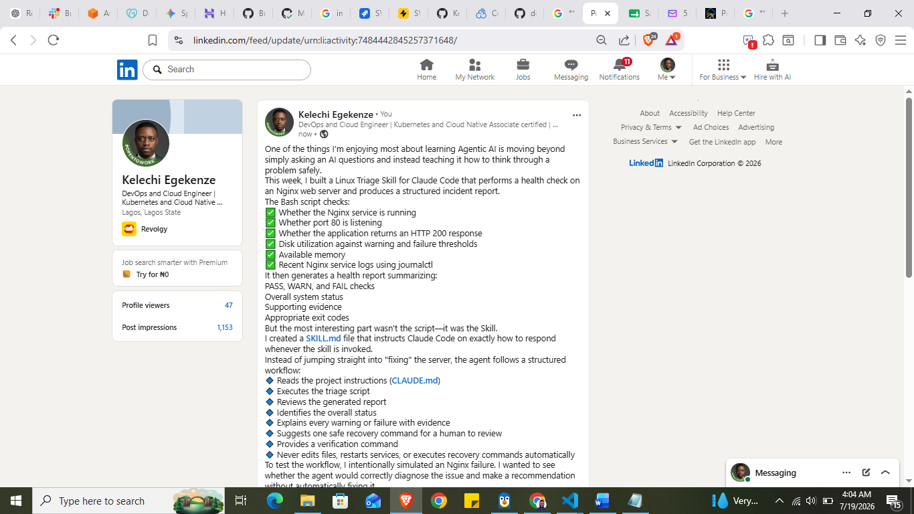

---

# GitHub Repository URL

Paste the URL of your GitHub folder or repository containing the assignment files here:

`https://github.com/Keicee32/devops-micro-internship-pravinmishra`

---

# Submission Instructions

- Add all required screenshots in your submission
- Full Name must be visible in required screenshots and the Bash report
- All written answers must be in your own words
- Do not expose sensitive information (keys, passwords, AWS account IDs, tokens)
- GitHub URL must be included in this document

---

# Completion Checklist

- [✅] Task 1: Healthy baseline confirmed, workspace created (Screenshots 1–2, Notes answered)
- [✅] Task 2: CLAUDE.md created with all four sections (Screenshot 3, Notes answered)
- [✅] Task 3: Five-check plan produced by Claude using read-only tools (Screenshot 4, Notes answered)
- [✅] Task 4: `linux-triage.sh` created, syntax validated, executable permission set (Screenshots 5–8, Notes answered)
- [✅] Task 5: Healthy-state report generated with no FAIL result (Screenshots 9–10, Notes answered)
- [✅] Task 6: `/linux-triage` skill created and run successfully on healthy server (Screenshots 11–12, Notes answered)
- [✅] Task 7: Nginx incident simulated, failed evidence captured, Claude did not execute recovery (Screenshots 13–15, Notes answered)
- [✅] Task 8: Nginx recovered manually, recovery verified, reports saved, incident summary complete (Screenshots 16–19, Notes answered)
- [✅] Incident summary contains all seven required sections
- [✅] LinkedIn post published and URL submitted
- [✅] Full Name visible in all required screenshots and the Bash report
- [✅] Skill does not have Write permission
- [✅] Skill did not execute any recovery commands
- [✅] No sensitive data exposed

---

## 📌 About DMI & CloudAdvisory

DevOps Micro Internship (DMI) is a project-based DevOps program run by Pravin Mishra (The CloudAdvisory) focused on real-world execution, systems thinking, and career readiness.

It helps learners build strong DevOps foundations with hands-on experience.

---

## 📌 Resources

- 🌐 DMI Official Website: https://pravinmishra.com/dmi  
- 🎓 DevOps for Beginners (Udemy): https://www.udemy.com/course/devops-for-beginners-docker-k8s-cloud-cicd-4-projects/  
- 🎓 Agentic AI DevOps with Claude Code: https://www.udemy.com/course/ultimate-agentic-ai-devops-with-claude-code/  
- 🎓 DevOps with Claude Code: Terraform, EKS, ArgoCD & Helm: https://www.udemy.com/course/devops-with-claude-code-terraform-eks-argocd-helm/  
- ▶️ YouTube Playlist: https://www.youtube.com/playlist?list=PLFeSNDtI4Cho  
- 🔗 Pravin Mishra (LinkedIn): https://www.linkedin.com/in/pravin-mishra-aws-trainer/  
- 🏢 CloudAdvisory (LinkedIn): https://www.linkedin.com/company/thecloudadvisory/

---

*This submission is part of DevOps Micro Internship (DMI) Cohort 3 — Agentic AI Track.*